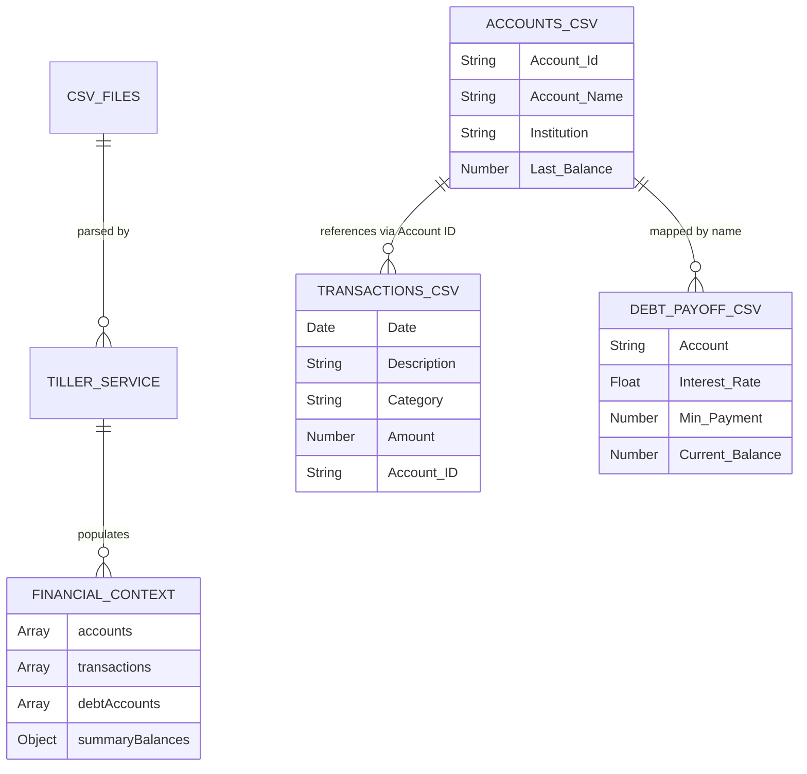
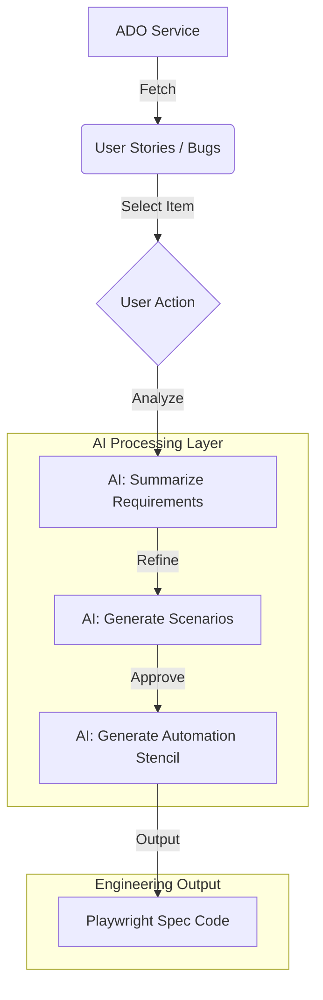
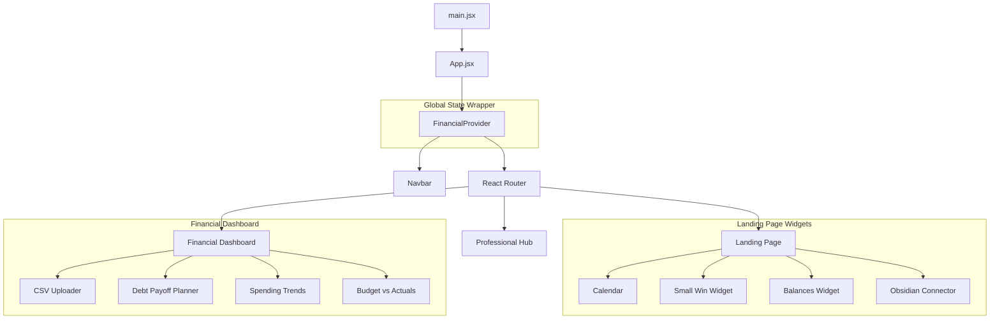
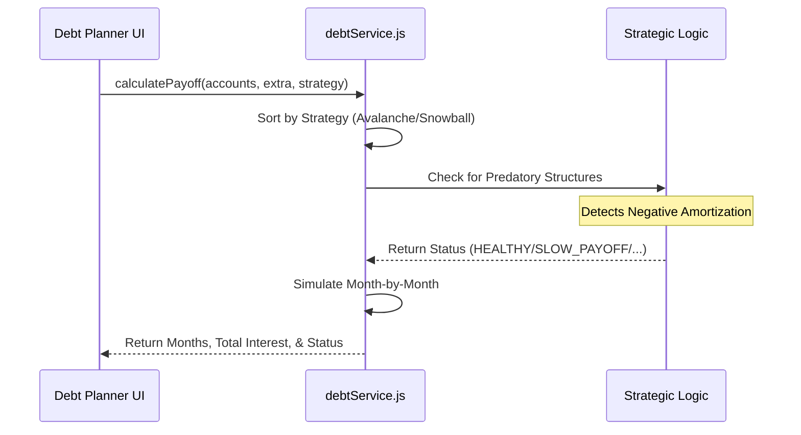

# Life.io System Architecture

This document provides a human-friendly overview of the Life_OS project (Life.io), bridging the gap between the codebase and system-wide understanding.

## 1. Financial Data Pipeline (ERD)

Life.io uses a "CSV-as-Database" architecture, primarily ingesting data exported from Tiller Money templates. The `FinancialContext` acts as the central state manager.

## 2. Professional Hub: AI QA Co-Pilot (Flow Chart)

The Professional Hub leverages AI to accelerate the QA lifecycle by transforming raw Azure DevOps (ADO) data into actionable automation assets.

## 3. Application Component Hierarchy

Visualizing how the React application is structured and how state flows through the system.

## 4. Debt Payoff Logic (Strategic Sequence)

The `debtService.js` performs contextual analysis based on the user's financial health.

