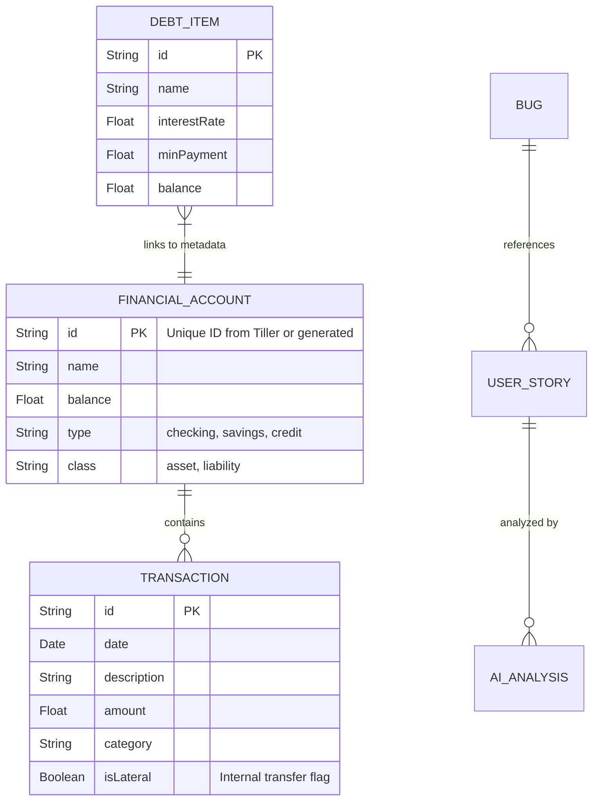
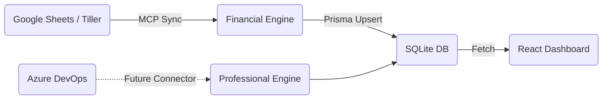

# Life.io System Architecture

This document provides a human-friendly overview of the Life_OS project (Life.io), bridging the gap between the codebase and system-wide understanding.

## 1. The Core Data Engine (SQLite + Prisma)

Life.io has transitioned from a legacy CSV-based model to a robust **SQLite-First** architecture. The Node.js backend serves as the single source of truth, managing data via Prisma.



## 2. Modular Engine Architecture (Backend)

The server is organized into specialized engines, each with its own Repository, Service, and Controller.

*   **Financial Engine**: Processes Tiller syncs, calculates "The Hottest Dollar", and manages drift detection.
*   **Professional Engine**: Manages Agile workflows (User Stories, Bugs) and prepares data for AI Analysis.
*   **Social Engine**: Manages Clients, Invoices, and DJ performance metrics.
*   **Life Admin Engine**: (Upcoming) Will manage health, reading, and personal logistics.

## 3. UI Component Hierarchy (Frontend)

The React application is organized into **Domain-Specific Modules** to support eventually selling different tiers (Free, Pro, Enterprise).

```mermaid
graph TD
    Root[main.jsx] --> App[App.jsx]
    App --> Prov[FinancialContext]

    subgraph System Module
    Nav[Navbar + Workspace Switcher]
    DB[Data Debugger]
    end

    Prov --> Nav
    Prov --> Routes[React Router]

    subgraph Finance Module (Life OS)
    FD[Financial Dashboard]
    FD --> MF[Strategic Money Map]
    FD --> SH[The Sorting Hat]
    FD --> ST[Spending Trends]
    end

    subgraph Professional Module (Work OS)
    PH[Professional Hub]
    PH --> AB[Agile Board]
    PH --> AI[AI QA Co-Pilot]
    end

    subgraph Life Admin Module
    LP[Landing Page]
    LP --> Cal[Calendar]
    LP --> DR[Daily Reads]
    end
```

## 4. Sync & Integration Flow



## 5. Billing & Subscription Strategy (Future SaaS Layer)

As Life.io evolves into a platform, the **Invoice Manager** (currently in Social Engine) will mature into a central **Billing Engine**.

*   **Payment Provider:** Stripe (Primary candidate) or Lemon Squeezy (Merchant of Record).
*   **Idempotency:** All charges must be idempotent to prevent double-billing. The Provider is the source of truth; our DB is a synced replica.
*   **Webhooks:** We will not poll for status. We will expose `api/webhooks/stripe` to listen for `invoice.paid` and `subscription.updated` events.
*   **Customer Portal:** We will leverage the Provider's hosted portal for self-serve card updates and plan changes, minimizing our PCI scope and dev effort.